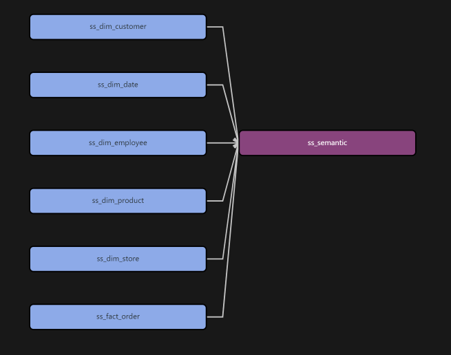

#Setting up Data Warehouse on Snowflake via DBT#

## Step-bys-step ##

### Extract and Load (Airbyte) ###
- Open the Docker application
- Start Airbyte by opening a terminal and running the following (you may be able to just click the local host link below instead of running the following):
``` cd airbyte ```
``` ./run-ab-platform.sh ```
- Open up a browser and go to http://localhost:8000. It can take a while for the Airbyte service to start, so don't be surprised if it takes ~10 minutes.
    - Username: airbyte
    - Password: password
- Click `Set up a new source`
- When defining a source, select `Microsoft SQL Server (MSSQL)`
    - Host: `**********`
    - Port: `1433`
    - Database: `Example`
    - Username: `User1`
    - Password: '*********'
- Select `Scan Changes with User Defined Cursor`
- Click `Set up source`
    - Airbyte will run a connection test on the source to make sure it is set up properly
- Create a schema in your database named `Sams_Subs` and ensure you have a data warehouse named `lastname_wh`

- Once Airbyte has run the connection test successfully, you will pick a destination, select `Pick a destination`.
- Find and click on `Snowflake`
    - Host: `https://******.snowflakecomputing.com` 
    - Role: `TRAINING_ROLE` 
    - Warehouse: `lastname_WH` 
    - Database: `Example_DB` 
    - Schema: `Sams_Subs`
    - Username: 
    - Authorization Method: `Username and Password`
    - Password: '********'
    - Click `Set up destination`
- Once the connection test passes, it will pull up the new connection window
    - Change schedule type to `Manual`
    - Under `Activate the streams you want to sync`, click the button next to each table.
    - Click Set up connection
    - Click `Sync now`
    - Once it's done, go to Snowflake and verify that you see data in the landing database

### Transform (dbt) ###
- Open VSCode
- File > Open > Select your project (lastname_DW)
- On the top bar of the application, select Terminal > New Terminal
    - This will open a terminal in the directory of your project within VSCode
- Right click on the models directory and create a new folder inside of it. (Be careful not to create it inside of the example directory.)
- Call this new folder `Sams_Subs`
- Right click on Sams Subs and create a new file. Name this file `_src_Sams_Subs.yml`
    - In this file we will add all of the sources for Sams Subs's tables
- Populate the code that we will use in this file below: 
```
version: 2

sources:
  - name: sams_subs_landing
    database: example_DB
    schema: SAMS_SUBS
    tables:
      - name: customer
      - name: employee
      - name: orderline
      - name: orders
      - name: product
      - name: store
```

- If you need to make any changes to your Snowflake information in your dbt project you can change it by going to your dbt profile.yml file. You may need to change the schema. 
    - On a mac, this is located under your user directory. You have to click Shift + command + . in order to see hidden folders. The .dbt folder will appear and inside is profiles.yml
    - On Windows, it's just in the user directory under the .dbt folder and the profiles.yml is inside.
    - Once you have found the profiles.yml file you can open in a text editor, change the needed parameters and save the file. 


#### dim customer ####
- Create a new file inside of the Sams Subs directory called `ss_dim_customer.sql`
- Populate the code that we will use in this file below: 
```
{{ config(
    materialized = 'table',
    schema = 'DW_SAMS_SUBS'
    )
}}


select
{{ dbt_utils.generate_surrogate_key(['customer_id', 'customer_first_name']) }} as customer_key,
customer_id,
customer_first_name,
customer_last_name,
customer_birthdate,
customer_phone
state
FROM {{ source('sams_subs_landing', 'customer') }}
```

- Save the file and build the model. Go to Snowflake to see the newly created table!


#### dim date ####
- Create a new file inside of the Sams Subs directory called `ss_dim_date.sql`
- Populate the code that we will use in this file below: 
```
{{ config(
    materialized = 'table',
    schema = 'DW_SAMS_SUBS'
    )
}}

with cte_date as (
{{ dbt_date.get_date_dimension("1990-01-01", "2050-12-31") }}
)

SELECT
date_day as date_key,
date_day,
day_of_week,
month_of_year,
month_name,
quarter_of_year,
year_number
from cte_date
```

- Save the file and build the model. Go to Snowflake to see the newly created table!


#### dim employee ####
- Create a new file inside of the Sams Subs directory called `ss_dim_employee.sql`
- Populate the code that we will use in this file below: 
```
{{ config(
    materialized = 'table',
    schema = 'DW_SAMS_SUBS'
    )
}}

SELECT
{{ dbt_utils.generate_surrogate_key(['employee_id', 'employee_birthdate']) }} as employee_key,
employee_id,
employee_first_name,
employee_last_name,
employee_birthdate
FROM {{ source('sams_subs_landing', 'employee') }}
```

- Save the file and build the model. Go to Snowflake to see the newly created table!


#### dim product ####
- Create a new file inside of the Sams Subs directory called `ss_dim_product.sql`
- Populate the code that we will use in this file below: 
```
{{ config(
    materialized = 'table',
    schema = 'DW_SAMS_SUBS'
    )
}}


select
{{ dbt_utils.generate_surrogate_key(['product_id', 'product_name']) }} as product_key,
product_id,
product_type,
product_name,
product_cost,
product_calories,
sandwich_length
sandwich_bread_type
FROM {{ source('sams_subs_landing', 'product') }}
```

- Save the file and build the model. Go to Snowflake to see the newly created table!

#### dim store ####
- Create a new file inside of the Sams Subs directory called `ss_dim_store.sql`
- Populate the code that we will use in this file below: 
```
{{ config(
    materialized = 'table',
    schema = 'DW_SAMS_SUBS'
    )
}}

SELECT
{{ dbt_utils.generate_surrogate_key(['store_id', 'store_address']) }} as store_key,
store_id,
store_address,
store_city,
store_state,
store_zip
FROM {{ source('sams_subs_landing', 'store') }}
```

- Save the file and build the model. Go to Snowflake to see the newly created table!


#### fact Order ####
- Create a new file inside of the Sams Subs directory called `ss_fact_order.sql`
- Populate the code that we will use in this file below: 
```
{{ config(
    materialized = 'table',
    schema = 'DW_SAMS_SUBS'
) }}

SELECT
    c.customer_key,
    d.date_key,
    e.employee_key,
    p.product_key,
    s.store_key,
    ol.order_line_price as price,
    ol.order_line_qty AS quantity
FROM {{ source('sams_subs_landing', 'orderline') }} ol
INNER JOIN {{ source('sams_subs_landing', 'orders') }} ord ON ord.order_id = ol.order_id
INNER JOIN {{ ref('ss_dim_customer') }} c ON ord.customer_id = c.customer_id
INNER JOIN {{ ref('ss_dim_date') }} d ON d.date_day = ord.order_date
INNER JOIN {{ ref('ss_dim_employee') }} e ON ord.employee_id = e.employee_id
INNER JOIN {{ ref('ss_dim_product') }} p ON p.product_id = ol.product_id
INNER JOIN {{ ref('ss_dim_store') }} s ON s.store_id = ord.store_id
```

- Save the file and build the model. Go to Snowflake to see the newly created table!


#### fact Inventory ####
- Create a new file inside of the Sams Subs directory called `ss_fact_inventory.sql`
- Populate the code that we will use in this file below: 
```
{{ config(
    materialized = 'table',
    schema = 'dw_sams_subs'
) }}

SELECT
    p.product_key,
    s.store_key,
    0 AS quantity_on_hand
FROM {{ ref('ss_dim_product') }} p
CROSS JOIN {{ ref('ss_dim_store') }} s
```

- Save the file and build the model. Go to Snowflake to see the newly created table!


## Create a semantic layer model
- Create a model that can query from the data warehouse we just built and reference upstream models.
- Create a new file called `ss_semantic.sql` inside of the sams subs directory.
- Basically, your code will create a new table that will be a semantic layer that is easy for consumption. The table should include key information that an analyst could easily pull from to run quick analysis. 
- This model should use 'ref' instead of source in the from statements. This will allow dbt to build lineage dag of the model dependencies:
- Populate the code that we will use in this file below: 
```
{{ config(
    materialized='table',
    schema='dw_sams_subs'
) }}

SELECT
    d.date_day AS order_date,
    c.customer_first_name AS cust_fname,
    e.employee_first_name AS emp_fname,
    p.product_name,
    s.store_address,
    o.price AS unit_price,
    o.quantity,
    (o.price * o.quantity) AS total_sale_amount
FROM {{ ref('ss_fact_order') }} o
INNER JOIN {{ ref('ss_dim_customer') }} c ON o.customer_key = c.customer_key
INNER JOIN {{ ref('ss_dim_date') }} d ON o.date_key = d.date_key
INNER JOIN {{ ref('ss_dim_employee') }} e ON o.employee_key = e.employee_key
INNER JOIN {{ ref('ss_dim_product') }} p ON o.product_key = p.product_key
INNER JOIN {{ ref('ss_dim_store') }} s ON o.store_key = s.store_key

```

- In order to view lineage, the dbt power user extension must be installed. Click on the Lineage tab in vscode (down by the terminal on the bottom), if you are inside the sem_claims.sql model, you should be able to see lineage for that model. View the lineage for the other files in the model as well. 



